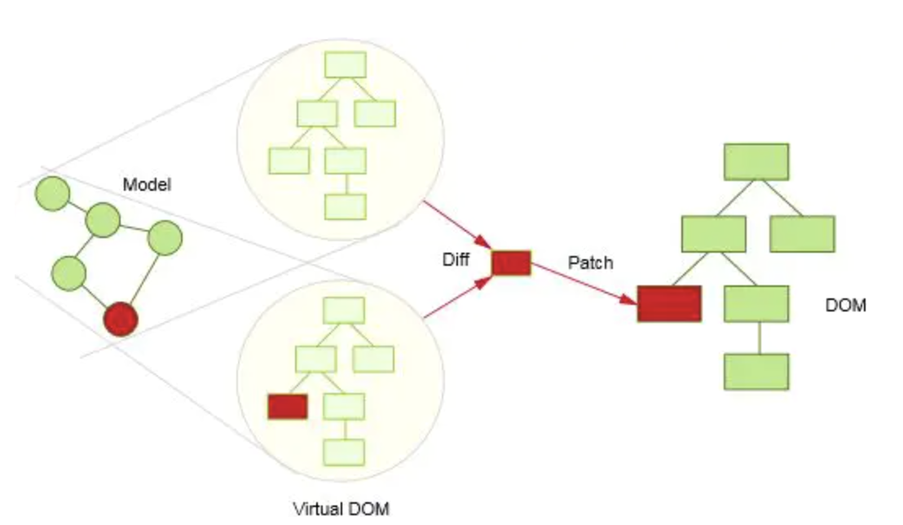

## 01.vue的生命周期

Vue生命周期总共分为8个阶段：创建create--> 挂载mount --> 更新update --> 销毁destroy

**(1) 下表包含如何在 setup () 内部调用生命周期钩子：**

| 选项式API  | setup  | 描述 |
| --- | --- | --- |
| -- | beforeCreate | 组件实例被创建之初，组件的属性生效之前 |
| --  | created | 组件实例已经完全创建，属性也绑定，但真实DOM还没有生成，$el还不可用 |
| onBeforeMount | beforeMount | 在挂载开始之前被调用，相关的render函数首次被调用 |
| onMounted | mounted | el被创建的vm.$el替换，并挂载到实例上去之后调用该钩子(一般业务逻辑会在这里开始) |
| onBeforeUpdate | beforeUpdate | 组件数据更新之前调用，发生在虚拟DOM打补丁之前 |
| onUpdated | updated | 组件数据更新之后 |
| onBeforeUnmount | beforeDestroy | 组件销毁前(主要解绑一些addEventListener监听的事件等) |
| onUnmounted | destroyed | 组件销毁后 |

**(2) 父子组件生命周期钩子函数执行顺序**

加载渲染过程，其中子组件先mounted：

父beforeCreate -> 父created -> 父beforeMount -> 子beforeCreate -> 子created -> 子beforeMount -> 子mounted -> 父mounted

子组件更新过程：

父beforeUpdate -> 子beforeUpdate -> 子updated -> 父updated

## 02.computed 与 watch
**(1)computed:**

在计算属性中,可以完成各种复杂的逻辑,包含运算,函数调用,最终返回一个结果就可以
- 减少模板中计算逻辑
- 数据缓存，所依赖的数据发生变化时,它才会重新取值
- 依赖其他计算属性,不仅可以依赖当前的vue实例的数据,还可以依赖其他实例的数据
- 可以文本插值,可以动态设置元素的样式
- 多数情况下,只用默认的getter方法来读取一个计算属性,可使用默认的写法.

```js
computed: {
    reversedMessage() {
        return this.message.split('').reverse().join('')
    },
    // 加上依赖数据参数
    TimeConversion() {
        return (date)=>{
            return dataFormat(date)
        }
    }
}
```

```js
setup() {
    // 或者可以绑定在person对象上
    // person.fullName = computed(()=>{
    let fullName = computed(()=>{
        return person.firstName + person.lastName
    })
}
```

**(2)watch:**
- 更加灵活和通用
- watch可以执行任何逻辑
- 如函数节流,ajax获取数据,操作DOM

常用场景：父组件发生数据变化，动态的传递给子组件，子组件实时刷新视图

（因为有的时候是在created 或 mounted里面调用方法，然后这个方法只执行一次，所以需要监听数据的变化，调取对应的方法）

**浅度监控:**
默认有2个参数，新值和旧值
```js
watch:{
    //监控list，发生变化就执行
    list:function(newVal, oldVal){
        store.save("new-class",this.list);
    }
},
```

**深度监控:**
监听器会层层遍历, 给对象的所有属性(及子属性)添加监听器，性能开销大
```js
watch:{
    list:{
        handler:function(){
            store.save("miaov-new-class",this.list);
        },
        deep:true
    }
},
```

**setup中使用：**
```js
import { watch, ref } from 'vue'
setup() {
    watch(mes, (newV, oldV) => {
        console.log('变化----', newV)
    }, {immediate: true})
}
```
扩充了解：[vue3中你不知道的watch和watchEffect 侦听器](https://juejin.cn/post/7032658568272691231)

## 03.Filter 数据过滤

**1.注册全局Filter**

```js
// 创建 - filter.js
export  const normalTime=(time)=>{
    if(time){
        var odate = new Date();
        odate.setTime(time);
        var year = odate.getFullYear();
        var month = odate.getMonth()+1;
        var day = odate.getDate();
        return year+'-'+month+'-'+day;
    }
}
```

```js
// 引入 - main.js
import * as filters from '../../assets/js/filters'

Object.keys(filters).forEach(key => {
    Vue.filter(key, filters[key])
})
```


**2.使用Filter**

(1)可以应用在{{ }}和v-bind中，使用管道 |

```html
<p>{{ message | filterA | filterB }}</p>
<p>{{ message | filterA('arg1', arg2) }}</p>
<div :id="rawId | formatId"></div>
```

(2)在js或者v-html中，使用$options.filters

```html
<span v-html="$options.filters.filterAdd1(value)"></span>

let sumsVal = this.$options.filters.formatRate(sumsArr, '')
```

(3)vue3删除了filter功能，用方法调用或计算属性替换过滤器

## 04.mixins 混入

混入 (mixins)定义了一部分可复用的方法或者计算属性

**1. 全局混入**时，在index.js文件中引入
```js
import { mixin } from 'common/mixin'
Vue.mixin(mixin)
```

**2. 组件混入**时，在组件中引入
```js
import { mixin } from 'common/mixin'
mixins: [ Mixin ]
```

## 05.修饰符的使用

**1.事件修饰符**

.stop阻止冒泡、.prevent阻止默认事件、.capture阻止捕获、.self事件源、.once
```html
<!-- 提交事件不再重载页面 -->
<form @submit.prevent="onSubmit"></form>
```

**2.按键修饰符**

.enter、.tab、.delete 、.esc、.space、.up、.down、.left、.right

```html
<input type="text" @keyup.enter="uphandle" />
<input type="text" @keyup.13="uphandle" />
<input type="text" @keyup.65="uphandle" />
```

**3.v-model修饰符**
```html
<!-- 用于控制数据同步的时机 -->
<input type="text"   v-model.lazy="message">    // 失焦或按回车时才更新
<input type="text"   v-model.trim="message">    // 过滤首尾空格
<input type="number" v-model.number="message">  // 输入转换为Number型
```

## 06.其他基础指令

**1.v-text**: 更新元素的textContent,可代替{{}}
```html
// 当页面加载,出现{{}}闪顿,可改写为v-text
<p>{{message}}</p>
<p v-text="message"></p>
```

**2.v-html**: 更新元素的innerHTML, 可加标签并解析
```html
<p v-html="message"></p>
let message = '<div>标签</div>'
```

**3.v-cloak**: 隐藏未编译的标签直到实例准备完毕(优化体验),解决页面闪动
```html
<style>
    [v-cloak]{
        display: none;
    }
</style>

<p>{{message}}</p>
```

**4.v-once**: 只渲染一次,随后数据改变将不再重新渲染,视为静态内容,用于优化更新性能

## 07.v-class 与 v-style

**1.数组写法**
```html
<div :class="[ classA, classB]"></div>
<div :class="[errorClass ,isActive ? activeClass : '']"></div>
<div :class="[ classA, { classB: isB, classC:isC }]"></div>
```

**2.对象写法**
```html
<div class="static"
     :class="{ 'active': isActiveTab, 'error': hasError }">
</div>
```

**3.计算属性写法**
```html
// 绑定一个返回对象的计算属性
<div :class="classObject"></div>
```

## 08.理解响应式原理

**1. vue2的 defineProperty**
- vue的双向绑定不过是语法糖
- object.defineProperty是用来做响应式更新的,和双向绑定没有关系
- vue将遍历此对象所有的属性,并使用Object.defineProperty把这些属性全部转为getter/setter
- 通过发布-订阅模式实现数据变化与视图更新的一致性
- vue内部会对数据进行劫持操作,进而追踪依赖,在属性被访问和修改时通知变化

```js
// 访问器描述getter,setter:
Object.defineProperty(obj,'title', {
	get(){
		console.log('我访问数据了');
		return val
	},
	set(newValue){
		console.log('我设置了新值');
		console.log(newValue);
		val = newValue;
	}
})
```

Object.defineProperty的缺陷：
- 对于对象新增的属性将不会是响应式的(因而表单的属性需要初始化)
- 不支持属性值是数组的情况

**2. vue3的Proxy**

基于ES6的proxy实现数据劫持(即双向绑定)

- Proxy它去拦截的是 「修改 data 上的任意 key」 和 「读取 data 上的任意 key」
- Proxy 更加强大的地方还在于 Proxy 除了 get 和 set，还可以拦截更多的操作符

```js
new Proxy(data, {
    get(key) { },
    set(key, value) { },
})
```

扩充了解：[实现双向绑定Proxy比defineproperty优劣](https://juejin.cn/post/6844903601416978439#heading-8)

## 09.理解Virtual DOM

所谓虚拟DOM，就是一个JS对象，用来存储DOM树结构 [运行js本身速度是很快.但是大量操作DOM就会很慢.]

- 具备跨平台的优势(Virtual DOM是以JavaScript对象为基础而不依赖真实平台环境)
- 操作原生DOM慢，js运行效率高。我们可以将DOM对比操作放在JS层，提高效率
- 提升渲染性能

虚拟节点的过程：
- 它通过JS的Object对象模拟DOM中的节点，
- 然后再通过特定的render方法将其渲染成真实的DOM节点。 
- dom diff则是通过JS层面的计算，返回一个patch对象，即补丁对象，
- 再通过特定的操作解析patch对象，按下边四种格式节点类型改变属性改变文本改变增加/移动/删除子节点完成页面的重新渲染，



## 10.理解nextTick机制

当页面中的数据发生改变了，就会把该任务放到一个异步队列中，只有在当前任务空闲时才会进行DOM渲染，当DOM渲染完成以后，该函数就会自动执行。

为什么要异步更新视图?

Vue实现了一个queue队列，在下一个Tick（或者是当前Tick的微任务阶段）的时候，统一执行queue中Watcher的run。
同时，拥有相同id的Watcher不会被重复加入到该queue中去，所以不会执行1000次Watcher的run。
最终更新视图只会直接将num对应的DOM从0变成1000。
保证更新视图操作DOM的动作是在当前栈执行完以后下一个Tick（或者是当前Tick的微任务阶段）的时候调用，大大优化了性能。


场景实例：
- 例:获取输入框后获取焦点
- 例:获取元素宽度
```js
this.showit = true
  this.$nextTick(function () {
    // DOM 更新了
    document.getElementById("keywords").focus()
  })
```

扩充了解：[Vue异步更新策略及 nextTick 原理](https://juejin.cn/post/6844904169967452174)

## 11.Apache配置

运行在服务器端的项目

1\ 打包,生成dist文件夹
```
npm run build
```

2\ 路径

问题:当在appache环境服务器打开后,找不到js和css的路径,此时

config --> index.js中, 更改生成项目的路径, 设置为 assetsPublicPath: '/dist/',

```js
build: {
    env: require('./prod.env'),
    index: path.resolve(__dirname, '../dist/index.html'),
    assetsRoot: path.resolve(__dirname, '../dist'),
    assetsSubDirectory: 'static',
    assetsPublicPath: '/',
    productionSourceMap: true,
    // ...
}
```


对Appache的一些配置,

**方式1: Appache配置：**

```
<IfModule mod_rewrite.c>
    RewriteEngine On
    RewriteBase /
    RewriteRule ^index\.html$ [L]
    RewriteCond %{REQUEST_FILENAME} !-f
    RewriteCond %{REQUEST_FILENAME} !-d
    RewriteRule . /index.html [L]
</IfModule>
```

**方式2: Nginx配置：**

原理:当找不到页面路径的时候,就统一指向index.html页面, 这样就可以重定向找到.

```js
location / {
    root /home/我的应用跟目录;
    try_files $uri $uri/ /index.html =404;
}
```


## 12.其他小tips

1).子组件为何不能修改父组件的props
因为vue是单向数据流,数据的双向绑定依赖object.defineProperty()

2).this.$emit的返回值是什么?
是this,如果需要返回值可以使用回调参数

3).key
当有相同标签名的元素切换时，需要通过 key 特性设置唯一的值来标记以让 Vue 区分它们，否则 Vue 为了效率只会替换相同标签内部的内容。
**为什么不能用index来使用key**? 因为当dom树插入的时候,index的值会有变化,因而不准确.
