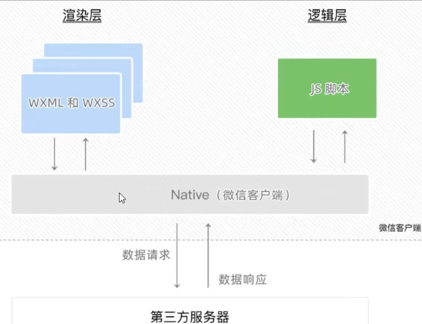
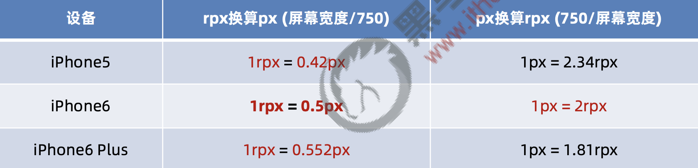

- 小程序的逻辑层和渲染层是分开的，逻辑层运行在 JSCore，并没有一个完整浏览器对象，因而缺少相关的DOM API和BOM API。
- 同时 JSCore 的环境同 NodeJS 环境也是不尽相同，所以一些 NPM 的包在小程序中也是无法运行的。
- 但小程序中可以调用微信环境提供的各种API，如：地理定位，扫码，支付


## 01.小程序代码的构成

**项目结构:**

- ① pages 用来存放所有小程序的页面
- ② utils 用来存放工具性质的模块（例如：格式化时间的自定义模块）
- ③ app.js 小程序项目的入口文件
- ④ app.json 小程序项目的全局配置文件
- ⑤ app.wxss 小程序项目的全局样式文件
- ⑥ project.config.json 项目的配置文件
- ⑦ sitemap.json 用来配置小程序及其页面是否允许被微信索引

**页面的组成部分:**

- ① .js 文件（页面的脚本文件，存放页面的数据、事件处理函数等）
- ② .json 文件（当前页面的配置文件，配置窗口的外观、表现等）
- ③ .wxml 文件（页面的模板结构文件）
- ④ .wxss 文件（当前页面的样式表文件）

### 1.JSON配置文件

(1) app.json 是当前小程序的全局配置，包括了小程序的所有页面路径、窗口外观、界面表现、底部 tab 等。

完整 https://developers.weixin.qq.com/miniprogram/dev/reference/configuration/app.html

```js
{
  // 所有页面路径
  "pages":[ 
    "pages/index/index",
    "pages/logs/logs"
  ],
  // 所有页面的背景色，文字颜色
  "window":{ 
    "backgroundTextStyle":"light",
    "navigationBarBackgroundColor": "#fff",
    "navigationBarTitleText": "WeChat",
    "navigationBarTextStyle":"black"
  },
  // style,全局定义小程序组件所使用的样式版本
  'style':'v2',
  //指明 sitemap.json 的位置
    "sitemapLocation": "sitemap.json"
}
```

(2) project.config.json 是项目配置文件，用来记录我们对小程序开发工具所做的个性化配置，

包括编辑器的颜色、代码上传时自动压缩等等一系列选项的开发者工具的配置(开发者工具-详情-项目设置)

完整 https://developers.weixin.qq.com/miniprogram/dev/devtools/projectconfig.html

- setting 中保存了编译相关的配置
- projectname 中保存的是项目名称
- appid 中保存的是小程序的账号 ID


(3) sitemap.json 文件用来配置小程序及其页面是否允许被微信索引（爬虫）

完整 https://developers.weixin.qq.com/miniprogram/dev/reference/configuration/sitemap.html
```js
{
  "rules": [{
      "action": "allow",
      "page": "*"   // 所有页面
  }]
}
```

(4)独立页面的.json 配置文件

小程序中的每一个页面，可以使用 .json 文件来对本页面的窗口外观进行配置，页面中的配置项会覆盖app.json 的 window 中相同的配置项。

独立定义每个页面的属性，如顶部颜色、是否下拉刷新等

完整 https://developers.weixin.qq.com/miniprogram/dev/reference/configuration/page.html

```js
{
  "navigationBarBackgroundColor": "#ffffff",
  "navigationBarTextStyle": "black",
  "navigationBarTitleText": "加载中...",
  "backgroundColor": "#eeeeee",
  "backgroundTextStyle": "light"
}
```


### 2.页面构成

- 1.wxml 和 html： 标签不同，属性不同，模版语法不同
- 2.wxss：新增rpx尺寸单位，新增全局和局部样式，wxss仅支持部分css选择器
- 3.小程序的js分三大类：
 - app.js是整个小程序项目的入口文件，通过调用App()函数来启动整个小程序
 - 页面js调用Page()函数来创建并运行页面
 - 普通js封装公共的函数或属性


## 02.小程序宿主环境

小程序借助宿主环境提供的能力，可以完成普通网页无法完成的功能，如：微信扫码、微信支付、微信登录、地理定位、etc…

(1) 通信模型

- ① 渲染层和逻辑层之间的通信 -- 由微信客户端进行转发
- ② 逻辑层和第三方服务器之间的通信 -- 由微信客户端进行转发



(2) 运行机制


小程序启动的过程：
- ① 把小程序的代码包下载到本地
- ② 解析 app.json 全局配置文件
- ③ 执行 app.js 小程序入口文件，调用 App() 创建小程序实例
- ④ 渲染小程序首页
- ⑤ 小程序启动完成

页面渲染的过程：
- ① 加载解析页面的 .json 配置文件
- ② 加载页面的 .wxml 模板和 .wxss 样式
- ③ 执行页面的 .js 文件，调用 Page() 创建页面实例
- ④ 页面渲染完成

(3) 组件

小程序中的组件也是由宿主环境提供的，开发者可以基于组件快速搭建出漂亮的页面结构。9大类分别是：

- ① 视图容器 / view
- ② 基础内容 / text
- ③ 表单组件 / input
- ④ 导航组件 / navigator
- ⑤ 媒体组件 / image
- ⑥ map 地图组件 / map
- ⑦ canvas 画布组件 / canvas
- ⑧ 开放能力 / open-data
- ⑨ 无障碍访问 / accessibility


(4) API

小程序中的API是由宿主环境提供的，开发者可以方便的调用微信提供的能力，如：获取用户信息、本地存储、支付功能等

小程序官方把 API 分为了如下 3 大类：

① 事件监听 API
- 特点：以 on 开头，用来监听某些事件的触发
- 举例：wx.onWindowResize(function callback) 监听窗口尺寸变化的事件

② 同步 API
- 特点1：以 Sync 结尾的 API 都是同步 API
- 特点2：同步 API 的执行结果，可以通过函数返回值直接获取，如果执行出错会抛出异常
- 举例：wx.setStorageSync('key', 'value') 向本地存储中写入内容

③ 异步 API
- 特点：类似于 jQuery 中的 $.ajax(options) 函数，需要通过 success、fail、complete 接收调用的结果
- 举例：wx.request() 发起网络数据请求，通过 success 回调函数接收数据

## 03.版本和发布

1. 软件开发过程中的不同版本

- 开发版本 使用开发者工具，可将代码上传到开发版本中。
- 体验版本 可以选择某个开发版本作为体验版，并且选取一份体验版。
- 审核中的版本 只能有一份代码处于审核中。有审核结果后可以发布到线上，也可直接重新提交审核，覆盖原审核版本。
- 线上版本 线上所有用户使用的代码版本，该版本代码在新版本代码发布后被覆盖更新。

2. 版本发布

一个小程序的发布上线，一般要经过上传代码 -> 提交审核 -> 发布这三个步骤。

(1) 上传代码
- 开发者工具 -> 顶部工具栏中的“上传” 按钮; 填写版本号以及项目备注

(2) 提交审核
- 小程序管理后台 -> 管理 -> 版本管理 -> 开发版本，即可查看刚才提交上传的版本了 -> 提交审核
- 为什么需要提交审核：为了保证小程序的质量，以及符合相关的规范，小程序的发布是需要经过腾讯官方审核的。

(3) 发布
- 小程序管理后台 -> 审核通过之后，管理员的微信中会收到小程序通过审核的通知，此时在审核版本的列表中，
- 点击“发布”按钮之后，即可把“审核通过”的版本发布为“线上版本”，供所有小程序用户访问和使用。

## 04. WXML 模板语法

1. 关于标签
```html
<view class="container">
  <!-- 0.navigator的使用 -->
  <view class="index-link">
    <navigator id="item-{{id}}" class="{{itemclass}}" url="{{itemurl}}">跳转</navigator>
  </view>

  <!-- 1. 视图组件 view 和 scroll-view -->
  <scroll-view class="container1" scroll-y>
    <view>A</view>
  </scroll-view>

  <!-- 2.基础内容组件 text 和 rich-text -->
  <view>
    手机号支持长按选中效果
    <text selectable>13800005056</text>
  </view>
  <rich-text nodes="<h1 style='color: red;'>标题</h1>"></rich-text>

  <!-- 3.图片的mode裁切方式 -->
  <view class="event-img">
    <image style="width: {{imagewidth}}" mode="{{imagemode}}" src="{{imagesrc}}"></image>
  </view>

  <!-- 4.weui框架的使用 -->
  <view class="weui-footer">
    <view class="weui-footer__text">框架的样式</view>
  </view>
  <mp-dialog title="test" show="{{true}}" bindbuttontap="" buttons="{{buttons}}">
    <view>test content</view>
  </mp-dialog>

  <!-- 5.wx:for使用 -->
  <block wx:for="{{logsList}}" wx:key="logId" wx:for-item="log">
    <text class="log-item">{{index + 1}}. {{log.date}}</text>
  </block>

  <!-- 6.轮播组件swiper -->
  <swiper indicator-dots="{{indicatorDots}}" autoplay="{{autoplay}}" interval="{{interval}}" duration="{{duration}}">
    <block wx:for="{{imgUrls}}" wx:key="*this">
      <swiper-item>
        <image src="{{item}}" style="width:100%;height:200px" class="slide-image" mode="widthFix" />
      </swiper-item>
    </block>
  </swiper>

  <!-- 7.audio组件 -->
  <audio src="{{musicinfo.src}}" poster="{{musicinfo.poster}}" name="{{musicinfo.name}}" controls></audio>
  <!-- 8.video组件 -->
  <video id="daxueVideo" src="{{url}}" autoplay loop muted initial-time="100" controls event-model="bubble"></video>
</view>
```

2. 关于事件

- 小程序中的事件传参比较特殊，不能在绑定事件的同时为事件处理函数传递参数。
- 因为小程序会把 bindtap 的属性值，统一当作事件名称来处理，相当于要调用一个名称为 btnHandler(123)的事件处理函数。
- 可以为组件提供 data-* 自定义属性传参，其中 * 代表的是参数的名字，value 是要传递的参数值。

按钮事件传参: 
```js
<button type="primary" bindtap="btnTap2" data-info="{{2}}">+2</button>

btnTap2(e) {
  // console.log(e.target.dataset.info) 参数值
  // dataset是一个对象，包含所有data-*自定义属性的值
  this.setData({
    count: this.data.count + e.target.dataset.info
  })
},
```

Input事件传参: 
```js
<input value="{{msg}}" bindinput="inputHandler"></input>

inputHandler(e) {
  // console.log(e.detail.value)
  // e.detail.value 获取最新的值
  this.setData({
    msg: e.detail.value
  })
},
```

## 05. WXSS 模板样式

官方建议：开发微信小程序时，设计师可以用 iPhone6 作为视觉稿的标准。
- 在 iPhone6 上，屏幕宽度为375px，共有 750 个物理像素，等分为 750rpx。则：
- 750rpx = 375px = 750 物理像素
- 1rpx = 0.5px = 1物理像素



## 06.全局配置和页面配置

1）全局开启下拉刷新功能

设置步骤：app.json -> window -> 把 enablePullDownRefresh 的值设置为 true

2）设置上拉触底的距离

设置步骤：app.json -> window -> 把 onReachBottomDistance: 100

```js
  "window":{
    "usingComponents": {},
    // 下拉刷新 - 推荐单独页配置
    "enablePullDownRefresh": true,
    // 下拉刷新 - 窗口样式
    "backgroundColor": "#efefef",
    "backgroundTextStyle": "dark",
    // 上拉触底 - 设置距离
    "onReachBottomDistance": 100
  }
```

3）配置 tabBar 选项

```js
  "window":{
    // 设置导航栏，颜色，text，背景色等
    "navigationBarBackgroundColor": "#dcc3b0",
    "navigationBarTitleText": "头像DIY",
    "navigationBarTextStyle":"black",
    "disableScroll": true,
    "navigationStyle":"custom",
  },
  // 配置tabbar
  "tabBar": {
    "list": [{
      "pagePath": "pages/home/home",
      "text": "首页",
      "iconPath": "/images/tabs/home.png",
      "selectedIconPath": "/images/tabs/home-active.png"
    },{
      "pagePath": "pages/message/message",
      "text": "消息",
      "iconPath": "/images/tabs/message.png",
      "selectedIconPath": "/images/tabs/message-active.png"
    }]
  },
```


## 07.网络数据请求

小程序官方对数据接口的请求做出了如下两个限制：
```js
① 只能请求 HTTPS 类型的接口
② 必须将接口的域名添加到信任列表中
② 域名不能使用 IP 地址或 localhost
④ 服务器域名一个月内最多可申请 5 次修改
```

**配置步骤：小程序管理后台 -> 开发 -> 开发设置 -> 服务器域名 -> 修改 request 合法域名**

- 小程序的宿主环境是微信客户端
- 跨域问题只存在于基于浏览器的 Web 开发中，小程序中不存在跨域的问题
- Ajax请求是依赖于浏览器中的 XMLHttpRequest 这个对象，小程序是“发起网络数据请求”

```js
  // 发起POST请求
  postInfo() {
    wx.request({
      url: 'https://www.escook.cn/api/post',
      method: "POST",
      data: {
        name: 'ls',
        age: 33
      },
      success: (res) => {
        console.log(res.data)
      }
    })
  },
```

## 08.页面导航

1）声明式导航

```html
<navigator url="/pages/message/msg" open-type="switchTab">导航到消息页面</navigator>
<navigator url="/pages/info/info" open-type="navigate">导航到info页面</navigator>
<navigator open-type="navigateBack" delta="1">后退</navigator>
```

2）编程式导航
```js
  // 跳转到tabBar页面
  gotoMessage() {
    wx.switchTab({
      url: '/pages/message/message'
    })
  },

  // 跳转到普通页面(带参数)
  gotoInfo() {
    wx.navigateTo({
      url: '/pages/info/info?name=ls&gender=男'
    })
  },

  // 后退
  goBack() {
    wx.navigateBack({
      delta: 1
    })
  },
```

```js
Page({
  // 设置传递过来的参数对象
  data: {
    query: {}
  },

  // 在 onLoad 中接收导航参数， options是导航参数对象
  onLoad: function (options) {
    this.setData({
      query: options
    })
  },

})
```

## 09.页面事件

1. 下拉刷新 -onPullDownRefresh

```js
Page({
  // 事件--监听用户下拉动作
  onPullDownRefresh: function () {
    // 需要重置的数据
    this.setData({
      page: 1,
      shopList: [],
      total: 0
    })
    // 重新发起数据请求
    this.getShopList(() => {
      wx.stopPullDownRefresh()
    })
  },
})
```
下拉刷新时，loading 效果会一直显示，不会主动消失；
调用 wx.stopPullDownRefresh() 可以停止当前页面的下拉刷新。

2. 上拉触底 - onReachBottom

```js
Page({
  onReachBottom: function () {
    // 最后一页
    if (this.data.page * this.data.pageSize >= this.data.total) {
      return wx.showToast({
        title: '数据加载完毕！',
        icon: 'none'
      })
    }
    // 判断是否正在加载其他数据
    if (this.data.isloading) return
    // 页码值 +1
    this.setData({
      page: this.data.page + 1
    })

    // 获取下一页数据
    this.getShopList()
  },
})
```

3. 分享 - onShareAppMessage

```js
Page({
  // 用户点击右上角分享 或者 页面内转发按钮
  // button组件open-type="share" 或右上角菜单“转发”按钮的行为，并自定义转发内容
  onShareAppMessage: function (res) {
    if (res.from === 'button') {
      // 来自页面内转发按钮
      console.log(res.target);
    }
    return {
      title: '训练营',
      path: 'pages/home/home',
      imageUrl: 'https://hackwork.oss-cn-shanghai.aliyuncs.com/lesson/weapp/4/weapp.jpg',
      success: function (res) {
        // 转发成功
      },
      fail: function (res) {
        // 转发失败
      },
    };
  },
})
```

## 10.生命周期

① 应用生命周期: 特指小程序从启动 -> 运行 -> 销毁的过程

② 页面生命周期: 每个页面的加载 -> 渲染 -> 销毁的过程

```js
App({
  // 监听小程序初始化，会触发（全局只触发一次）
  onLaunch: function () {},
  // 监听小程序启动或切前台
  onShow: function (options) {},
  // 监听小程序切后台
  onHide: function () {},


  onError:function(msg){},        //错误监听函数     
  onPageNotFound:function(){},   //页面不存在监听函数
  onUnhandledRejection:function(){},  //未处理的 Promise 拒绝事件监听函数   
  onThemeChange:function(){},        //监听系统主题变化
})
```

```js
Page({
  // 一个页面只调用一次
  onLoad: function (options) {},
  // 生命周期函数--监听页面初次渲染完成
  onReady: function () {},
  // 生命周期函数--监听页面显示
  onShow: function () {},
  // 生命周期函数--监听页面隐藏
  onHide: function () {},
  // 生命周期函数--监听页面卸载
  onUnload: function () {},
})
```

