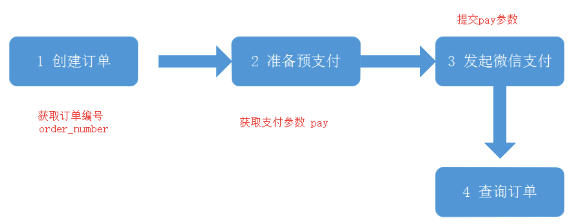

## 01. 小程序更新机制

**未启动时更新**

微信客户端会有若干个时机去检查本地缓存的小程序有没有更新版本，如果有则会静默更新到新版本。非实时更新

**启动时更新**

小程序每次冷启动时，都会检查是否有更新版本

1. wx.getUpdateManager API，需要马上应用最新版本

```js
const updateManager = wx.getUpdateManager()

updateManager.onCheckForUpdate(function (res) {
  // 请求完新版本信息的回调
  console.log(res.hasUpdate)
})

updateManager.onUpdateReady(function () {
  wx.showModal({
    title: '更新提示',
    content: '新版本已经准备好，是否重启应用？',
    success(res) {
      if (res.confirm) {
        // 新的版本已经下载好，调用 applyUpdate 应用新版本并重启
        updateManager.applyUpdate()
      }
    }
  })
})

updateManager.onUpdateFailed(function () {
  // 新版本下载失败
})
```

2. wx.getSystemInfoSync()  获取系统信息

```js
system	string	操作系统及版本  
```

可以判断微信的版本以及当前手机的系统版本，是否较低

## 02. 开放能力

用户信息， 转发， 消息， 授权, 拉起APP，卡券等

https://developers.weixin.qq.com/miniprogram/dev/framework/open-ability/login.html

### 1.小程序登录

小程序可以通过微信官方提供的登录能力方便地获取微信提供的用户身份标识，快速建立小程序内的用户体系。

(1) 客户端 - 调用wx.login() 获取临时登录凭证code
- 有效时间5分钟，每个code可验证一回),

(2) 服务端 - 登录凭证校验, 
- 使用 code + appid + appsecret[密钥] 向微信换取
- 调用 auth.code2Session 接口 获取用户唯一标识OpenID 和 会话密钥session_key
- 生成一个自定义登录态的token(令牌)响应回去给前端

(3) 客户端 - 将登录状态token 存入 缓存storage（推荐使用 wx.setStorageSync(‘key’, ‘value’) 同步存储）

```js
onLoad() {
    wx.login({
      // 01 调用接口获取登录凭证（code）
      success: (Result) => {
        // 02 向后台发起request.login请求,用code换取用户登录态信息openid,存储为token;
        request.login({
          code: Result.code
        }).then((token) => {
 
          // 存储用户登录态信息token
          wx.setStorageSync('token', token)
        }) .catch(error => {
          console.log("换取登录态token失败：",error)
        });
      },
      fail:(res)=> { console.log("获取登录凭证code失败！",res) }
    }) 
  },
```

### 2.授权 (如地理位置)

开发者可以使用 wx.authorize 在调用需授权 API 之前，提前向用户发起授权请求。
```js
// 可以通过 wx.getSetting 先查询一下用户是否授权了 "scope.userLocation" 这个 scope用户位置
wx.getSetting({
  success(res) {
    if (!res.authSetting['scope.userLocation']) {
      wx.authorize({
        scope: 'scope.userLocation',
        success () {
          // 用户已经同意
          ...
        },
        fail () {
          // 询问是否开启
          ...
        },

      })
    }
  }
})
```

### 3.设备信息

获取设备系统信息 wx.getSystemInfoSync
```js
try {
  const res = wx.getSystemInfoSync()
  console.log(res.model)
  console.log(res.pixelRatio)
  console.log(res.windowWidth)
  console.log(res.platform)
  console.log(res.environment)
} catch (e) {
  // Do something when catch error
}
```

### 4.uniapp微信支付

 微信支付的流程\
（1）创建订单
- 请求创建订单的 API 接口：把（订单金额、收货地址、订单中包含的商品信息）发送到服务器
- 服务器响应的结果：订单编号

（2）订单预支付
- 请求订单预支付的 API 接口：把（订单编号）发送到服务器
- 服务器响应的结果：订单预支付的参数对象，里面包含了订单支付相关的必要参数

（3）发起微信支付

- 调用 uni.requestPayment() 这个 API，发起微信支付；把步骤 2 得到的 “订单预支付对象” 作为参数传递给 uni.requestPayment() 方法
- 监听 uni.requestPayment() 这个 API 的 success，fail，complete 回调函数

### 5. 小程序微信支付



1. 获取微信收货地址  wx.chooseAddress({})

```js
  wx.chooseAddress({})
  address.all = address.provinceName + address.cityName + 
  address.countyName + address.detailInfo;
```
2. 渲染购物⻋中要结算的商品

3. 实现⽀付 wx.requestPayment({})
- 获取微信的登录信息
- 获取⾃⼰后台返回的⽀付相关参数
- 调⽤微信接⼝实现 ⽀付
- ⽀付成功创建订单

```js
// 1 判断缓存中有没有token 
const token = wx.getStorageSync("token");
// 2 购物车信息
// 价格，地址，商品信息(id, 数量，价格)
const cart = this.data.cart;
cart.forEach(v => goods.push({
  goods_id: v.goods_id,
  goods_number: v.num,
  goods_price: v.goods_price
}))
const orderParams = { order_price, consignee_addr, goods };
// 4 创建订单 - 获取订单编号
// order_number
const { order_number } = await request({ url: "/my/orders/create", method: "POST", data: orderParams });
// 5 发起 - 预支付接口
// pay
// 返回参数：应用ID，商户号，订单号，商品信息，地址，交易时间等
// https://pay.weixin.qq.com/wiki/doc/apiv3/apis/chapter3_5_1.shtml
const { pay } = await request({ url: "/my/orders/req_unifiedorder", method: "POST", data: { order_number } });
// 6 发起微信支付 
// wx.requestPayment({ })
await requestPayment(pay);

// 7 查询后台 订单状态
const res = await request({ url: "/my/orders/chkOrder", method: "POST", data: { order_number } });
await showToast({ title: "支付成功" });
// 8 手动删除缓存中 已经支付了的商品
let newCart=wx.getStorageSync("cart");
newCart=newCart.filter(v=>!v.checked);
wx.setStorageSync("cart", newCart);
  
// 8 支付成功了 跳转到订单页面
wx.navigateTo({
  url: '/pages/order/index'
});
```

