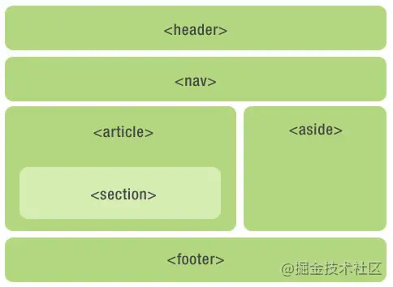

## 1.语义化标签
语义化标签使得页面的内容结构化，见名知义


## 2.Canvas绘图
getContext("2d") 对象是内建的 HTML5 对象，拥有多种绘制路径、矩形、圆形、字符以及添加图像的方法。

```js
// 把一幅图像放置到画布上, 使用 drawImage(image,x,y) 方法
var c = document.getElementById("myCanvas");
var ctx = c.getContext("2d");
var img = document.getElementById("scream");
ctx.drawImage(img,10,10); 
```

## 3.SVG绘图
SVG 与 Canvas两者间的区别:

SVG 是一种使用 XML 描述 2D 图形的语言。矢量图形

Canvas 通过 JavaScript 来绘制 2D 图形。像素图形

## 参考文档
1. [HTML5 新特性一览](https://juejin.cn/post/6844903829679390728#heading-23)